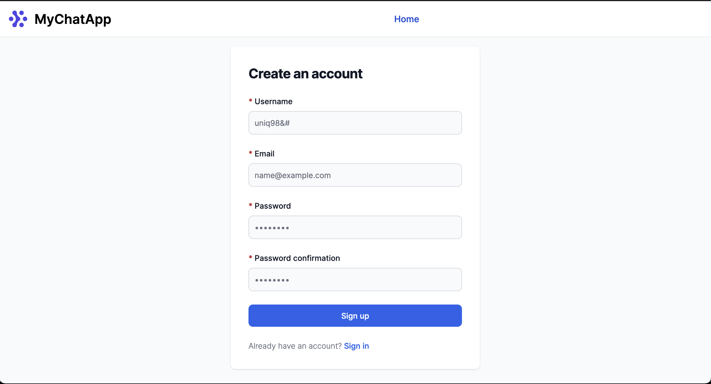
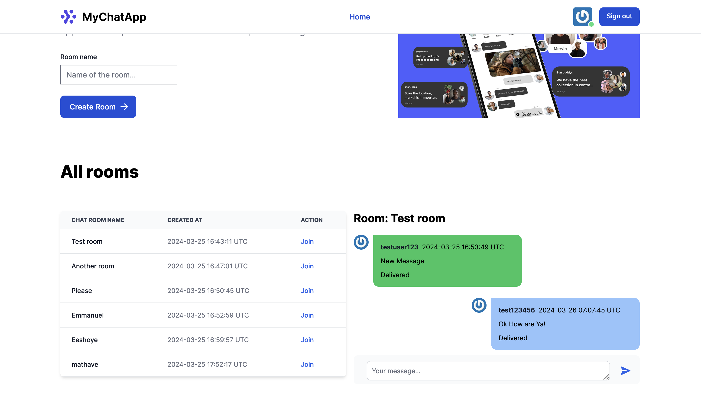

# Chat Application

This is a real-time chat application built with Ruby on Rails, leveraging user authentication, room creation/joining capabilities, and real-time messaging. It employs Hotwire for a minimal JavaScript footprint and Tailwind CSS for styling.





## System Requirements

- Ruby 3.3.0
- Rails 7.1.3.2
- PostgreSQL (database)
- Redis (key-value store and action cable)
- Docker

## Quick Start with Docker

For a quick start, you can run the app using Docker. This method encapsulates the environment setup and simplifies dependencies management. Ensure you have Docker and Docker Compose installed on your machine.

### Running the App with Docker

Clone the repository:

```
git clone https://github.com/tonyvince/chatroom_test
cd chatroom_test
```

Build the Docker containers:

`docker-compose build`

Start the application:

`docker-compose up`

The application should now be accessible at http://localhost:3000.

## Manual Setup

If you prefer a manual setup or need to develop with the application, follow these detailed steps.

### Clone the Repository

git clone https://github.com/tonyvince/chatroom_test
cd chatroom_test

### Install Dependencies

With Ruby 3.3.0 set for the project, install Bundler and project dependencies:

```
gem install bundler
bundle install
```

### Setup Database

Ensure PostgreSQL is installed and running. Configure config/database.yml then initialize your database:

```
rails db:create
rails db:migrate
```

### Setup Redis

Ensure Redis is installed and running, needed for action cable support. `redis-server`

### Run the Server

rails server

Visit http://localhost:3000 to view the application.

## Features

- Devise for user authentication
- Users can create, join chat rooms
- Real-time message exchange
- Messages are persisted in a PostgreSQL database
- Tailwind CSS for styling

## Technologies

- Ruby on Rails: The server-side web application framework
- Hotwire (Turbo & Stimulus): For rich, interactive, real-time applications
- Tailwind CSS: For utility-first styling
- PostgreSQL: As the relational database
- Redis: For key-value storage, especially for Action Cable
- Devise: For user authentication
- Docker for containarization
- Kamal for deployment

## Running Tests

`bundle exec rspec`

## Running linter

`bundle exec standard`

## Deployment with Kamal

To deploy with Kamal, configuration is located at config/deploy.yml. Adjust your host and other details as needed for your deployment environment.

## License

Open-source under the MIT License.
